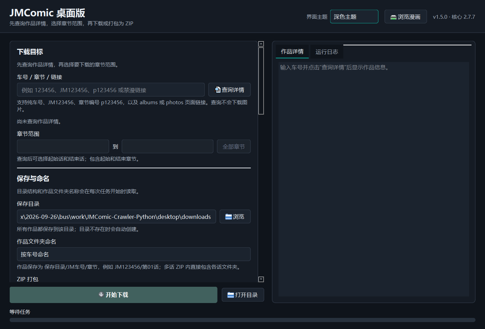
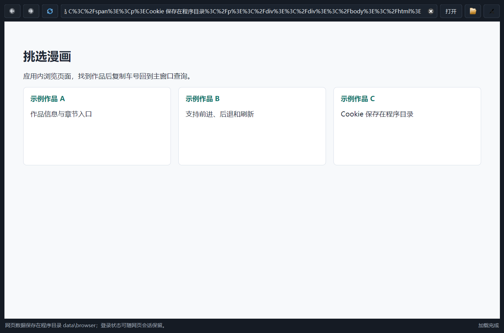

# JMComic Desktop and Android

JMComic Desktop 是一个面向 Windows 和 Android 的 JMComic 图形化下载器，提供
作品检索、完整详情查看、章节范围选择、并发下载、ZIP 整理、账号会话、自更新
和站内浏览。Android 版内置 Python 下载核心，不再是只打开网页的 WebView 壳。

Windows 和 Android 端都基于
[hect0x7/JMComic-Crawler-Python](https://github.com/hect0x7/JMComic-Crawler-Python)
提供的 Python API、下载器和插件系统构建。

> **致谢**
>
> 感谢 hect0x7 及所有贡献者开源
> [JMComic-Crawler-Python](https://github.com/hect0x7/JMComic-Crawler-Python)。
> 本项目复用其核心查询、下载和 ZIP 插件能力。上游使用 MIT License，
> 原始版权声明已保留在 [LICENSE](LICENSE)，完整说明见 [CREDITS.md](CREDITS.md)。

## 下载

公开版本发布在 GitHub Releases：

[下载最新版 JMComic Desktop](https://github.com/declinekid-design/jmcomic-desktop-android/releases/latest)

当前正式版本：

| 平台 | 文件 | 版本 | 说明 |
| --- | --- | --- | --- |
| Windows | `JMComicDesktop-1.5.0-portable.zip` | 1.5.0 | 免安装便携版 |
| Android | `JMComic-Android-1.0.0.apk` | 1.0.1 | Android 8.0+ 完整下载器 |

Windows 便携包解压后保持整个 `JMComicDesktop` 文件夹完整，然后双击
`JMComicDesktop.exe`。Android 安装 APK 后可查询详情、选择章节范围并直接下载，
也可以点击“浏览”打开配套站点挑选作品。

Release 页面提供附件 SHA-256；仓库中的 Android APK 固定校验值为：

```text
BE715F0475003C1E40FC954FEFE82E4A57612C27BEBA8F79421F7E5155E79D22
```

Android Release 附件继续使用 `JMComic-Android-1.0.0.apk` 这个稳定文件名，
用于直接替换旧的 1.0 附件；APK 内部版本已更新为 1.0.1，旧包不再提供。
仓库当前只保留 Windows 1.5.0 和 Android 1.0.1 对应的源码与下载文件。
旧版本不再保留对应构建附件，只会在更新记录中说明功能变化。

## 产品截图





## 核心能力

### Windows 桌面端 1.5.0

| 功能 | 具体行为 |
| --- | --- |
| 多种输入 | 支持车号、`JM123456`、章节号 `p123456` 和作品链接 |
| 作品详情 | 显示标题、ID、链接、作者、日期、页数、观看、点赞、评论、标签、人物和作品 |
| 章节列表 | 显示总话数、话名、章节编号，并允许选择开始和结束章节 |
| 范围下载 | 只下载所选章节范围，不必整部作品全部下载 |
| 两种命名 | 下载结果可按 `JM车号` 或漫画标题命名 |
| ZIP 整理 | 多话作品可打包为一个 ZIP，ZIP 内按“第几话 话名”建立文件夹 |
| 图片格式 | 可保留原格式，或统一输出为 JPG、PNG、WEBP |
| 并发控制 | 可分别调整图片并发数和章节并发数 |
| 网络设置 | 支持跟随系统代理、不使用代理或手动填写代理 |
| 主题 | 支持浅色、深色和跟随 Windows 系统主题 |
| 账号登录 | 支持账号密码登录，勾选“保持登录”后加密保存会话 |
| 内置浏览器 | 在应用内打开配套站点挑书，并支持前进、后退、刷新和系统打开 |
| 便携数据 | 设置、缓存、日志、会话和下载默认放在程序目录，不写入 `%APPDATA%` |
| 自更新 | 读取 HTTPS 清单、校验 SHA-256、等待退出、替换程序、失败回滚 |
| 更新保护 | 不覆盖 `data`、`downloads`、`updater`、预览图和更新文件目录 |

### Android 完整下载器 1.0.1

| 功能 | 具体行为 |
| --- | --- |
| 多种输入 | 支持车号、`JM123456`、章节号 `p123456` 和作品链接 |
| 作品详情 | 显示标题、ID、链接、作者、日期、页数、观看、点赞、评论、标签、人物、作品和章节列表 |
| 章节范围 | 可查看总话数，并选择从哪一话下载到哪一话 |
| 两种命名 | 下载结果可按 `JM车号` 或漫画标题命名 |
| 多话 ZIP | 多话作品打包为一个 ZIP，ZIP 内按“第几话 话名”建立多个文件夹 |
| 单话下载 | 只下载一话时保留图片文件夹，不额外打包 ZIP |
| 格式与并发 | 支持原格式、JPG、PNG、WEBP，以及图片和章节并发设置 |
| 网络设置 | 支持跟随 Android VPN/系统网络、不使用代理或手动代理 |
| 主题 | 支持浅色、深色和跟随 Android 系统主题 |
| 账号登录 | 弹窗输入账号密码，可选择保持加密会话 |
| 站内浏览 | 按钮打开 `https://comic18j-hbd.space/`，支持返回、刷新和网页下载 |
| 结果管理 | 扫描并打开 ZIP、图片和 APK，显示文件时间、大小和路径 |
| 自更新 | 读取仓库 HTTPS 清单，校验 SHA-256 后交给 Android 系统安装器 |
| 本地数据 | 设置、会话、日志、更新包和下载文件都放在应用自身目录 |
| 系统兼容 | minSdk 26、targetSdk 35，支持 arm64-v8a 和 x86_64 |
| 启动修复 | 修复浅色主题初始化顺序导致的冷启动闪退 |
| 图片兼容 | 使用 Android 原生解码桥接 WebP，下载图片统一转为可用 PNG |

Android 使用 Chaquopy 内置 Python 3.12、`jmcomic 2.7.7` 和相同下载流程。
应用数据位于 Android 分配给本应用的私有目录，不使用 `%APPDATA%`。

## 典型流程

1. 打开 Windows 或 Android 客户端，输入车号、JM 编号、章节号或作品链接。
2. 点击“查询详情”，等待标题、作者、统计信息、标签和章节列表返回。
3. 在“章节范围”中选择开始章节和结束章节，或点击“全部章节”。
4. 选择保存目录、车号命名或漫画名命名。
5. 根据需要设置图片格式、并发、代理，以及是否在多话下载后打包 ZIP。
6. 点击“开始下载”，在“运行日志”和进度条中查看结果。Android 版可在“结果”
   中打开生成的 ZIP 或图片。

## 下载目录结构

按车号命名：

```text
保存目录/
└─ JM350234/
   ├─ 第01话 上/
   │  ├─ 001.jpg
   │  └─ 002.jpg
   └─ 第02话 下/
      ├─ 001.jpg
      └─ 002.jpg
```

按漫画名命名：

```text
保存目录/
└─ 作品标题/
   ├─ 第01话 上/
   └─ 第02话 下/
```

多话作品打包后：

```text
JM350234.zip
├─ 第01话 上/
│  ├─ 001.jpg
│  └─ 002.jpg
└─ 第02话 下/
   ├─ 001.jpg
   └─ 002.jpg
```

## 程序数据目录

Windows 便携版运行时使用主程序所在目录：

```text
JMComicDesktop/
├─ JMComicDesktop.exe
├─ updater/
├─ data/
│  ├─ settings.json
│  ├─ session.bin
│  ├─ session.key
│  ├─ logs/
│  ├─ browser/
│  └─ updates/
└─ downloads/
```

密码本身不会写入设置或日志。选择“保持登录”后，服务器会话优先使用
Windows DPAPI 加密；不可用时使用程序目录内的 AES-GCM 后备密钥。

## 自更新

桌面端支持 HTTPS 清单和本地 JSON 清单。清单格式：

```json
{
  "version": "1.5.1",
  "url": "https://example.com/JMComicDesktop-1.5.1-win64.zip",
  "sha256": "64位小写SHA256十六进制值",
  "size": 12345678,
  "notes": "本次更新说明"
}
```

更新器会校验更新包路径、ZIP 结构、文件大小和 SHA-256，拒绝目录穿越、
符号链接以及包含 `data`、`downloads`、`updater` 的更新包。替换前会备份
当前程序；失败时自动回滚。用户配置、下载内容和登录会话不会被覆盖。

## 构建

### Windows 桌面端

需要 Windows、Python 3.12 和 PowerShell：

```powershell
cd desktop
.\build.ps1
```

脚本会安装 PySide6、PyInstaller 和上游 `jmcomic 2.7.7`，生成：

```text
dist/JMComicDesktop/
dist/JMComicDesktopUpdater/
```

构建后可以把 `JMComicDesktopUpdater` 打包进主程序的 `updater` 目录。

### Android 完整下载器

需要 JDK 17、Android Platform 35、Build-Tools 35.0.0 和 Python 3.12。
Gradle 会自动下载 Chaquopy、`jmcomic` 及 Android 专用依赖：

```powershell
$env:ANDROID_TOOLCHAIN_ROOT = 'C:\path\to\android-toolchain'
$env:CHAQUOPY_BUILD_PYTHON = 'C:\path\to\python.exe'

.\android\scripts\build_apk.ps1 `
  -ToolchainRoot $env:ANDROID_TOOLCHAIN_ROOT `
  -BuildPython $env:CHAQUOPY_BUILD_PYTHON `
  -OutputApk .\artifacts\JMComic-Android-1.0.0.apk
```

正式发布文件沿用 1.0 附件名以便覆盖替换，源码中的
`versionName` 为 `1.0.1`、`versionCode` 为 `3`。

工具链目录约定：

```text
android-toolchain/
├─ jdk/17.0.16/
├─ sdk/
│  ├─ platforms/android-35/android.jar
│  └─ build-tools/35.0.0/
├─ gradle-home/
└─ user-home/
```

构建脚本会执行 `assembleDebug` 和 `lintDebug`，复制 APK，调用 `apksigner`
验证，并输出文件大小与 SHA-256。

## 源码结构

```text
desktop/
├─ jmdesktop/
│  ├─ app.py              程序入口、主题初始化和自检
│  ├─ window.py           主窗口、查询、章节选择、下载和打包流程
│  ├─ details.py          作品详情格式化
│  ├─ downloader.py       范围下载和进度事件
│  ├─ jm_bridge.py        上游 jmcomic API 适配
│  ├─ login.py            账号登录弹窗
│  ├─ session.py          DPAPI/AES-GCM 会话保存
│  ├─ browser.py          Qt WebEngine 浏览窗口
│  ├─ settings.py         程序目录设置存储
│  ├─ theme.py            浅色和深色主题
│  ├─ update_manager.py   清单解析、下载和哈希校验
│  └─ widgets.py          通用界面组件
├─ updater_app.py         独立更新器与回滚逻辑
├─ build.ps1              PyInstaller 构建脚本
└─ JMComicDesktop.spec    Windows 打包配置

android/
├─ app/java/.../MainActivity.java        原生下载器主界面
├─ app/java/.../BrowserActivity.java     站内浏览按钮打开的 WebView
├─ app/java/.../DownloadsActivity.java   ZIP、图片和 APK 结果管理
├─ app/python/jmcomic_service.py         查询、范围下载、登录、ZIP 和更新核心
├─ app/res/                              主题资源、Manifest 和图标
├─ gradlew.bat                           Gradle Wrapper
├─ update-manifest.json                  Android 自更新清单
└─ scripts/build_apk.ps1                 Gradle + Chaquopy 构建与校验

artifacts/                  已构建 Android APK
docs/                       产品、源码、发布和截图文档
```

详细功能与文件对照见
[功能与源码对照](docs/功能与源码对照.md)，实现结构见
[架构说明](docs/架构说明.md)，发布流程见
[发布与下载](docs/发布与下载.md)。

## 验证

桌面端源码和打包版支持内建自检：

```powershell
python .\desktop\jmcomic_desktop.py --self-test
python .\desktop\jmcomic_desktop.py --smoke-test
python .\desktop\jmcomic_desktop.py --browser-smoke-test
python .\desktop\updater_app.py --self-test
```

自检覆盖输入解析、主题、命名规则、章节范围、详情格式、会话加密、更新清单、
打包版更新器和便携数据目录。Android 构建脚本会在输出 APK 后调用
`apksigner verify`。

## 已知限制

- Windows 构建和便携数据目录以 Windows 为主要目标。
- Android APK 使用固定调试签名，可覆盖安装同包名的 1.0 旧版；正式应用商店
  发布仍建议改用长期保管的发布证书。
- Android 自更新会下载并校验 APK，但最终安装必须由系统安装器确认，无法静默
  替换应用。
- 自动更新只负责替换程序文件，不负责托管或分发内容。
- 登录功能依赖上游 API 和站点当前行为，站点变更后可能需要适配。

## 隐私与合规

- 仓库不包含账号、密码、Cookie、登录会话、漫画图片或用户下载记录。
- Windows 版默认把运行数据放在程序目录，不上传用户文件。
- Android 版把设置、会话、日志、更新包和下载文件放在应用自身目录。
- 程序仅在用户主动查询、下载、登录和检查更新时访问网络。
- 本项目仅提供第三方开源 API 的图形界面和技术示例，不托管漫画内容。
- 请确认你已成年，并确认访问、下载和保存相关内容符合当地法律及站点条款。
- 请勿将本项目用于侵权、未授权传播或其他违法用途。

## 版本记录

完整版本记录见 [CHANGELOG.md](CHANGELOG.md)。每个功能、对应源码文件和验证点
见 [功能与源码对照](docs/功能与源码对照.md)。

## License and Credits

- Project code: [LICENSE](LICENSE)
- Upstream project: [hect0x7/JMComic-Crawler-Python](https://github.com/hect0x7/JMComic-Crawler-Python)
- Credits and notices: [CREDITS.md](CREDITS.md)
